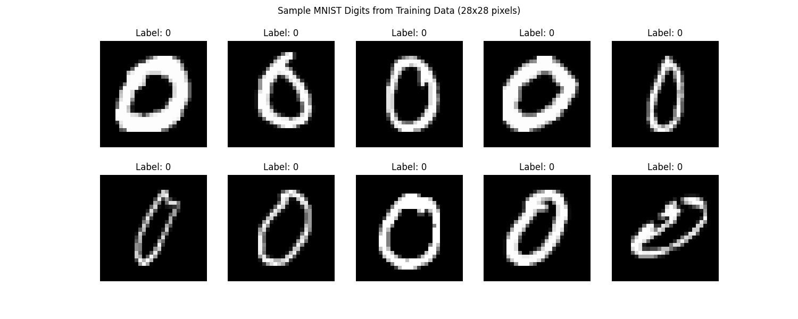
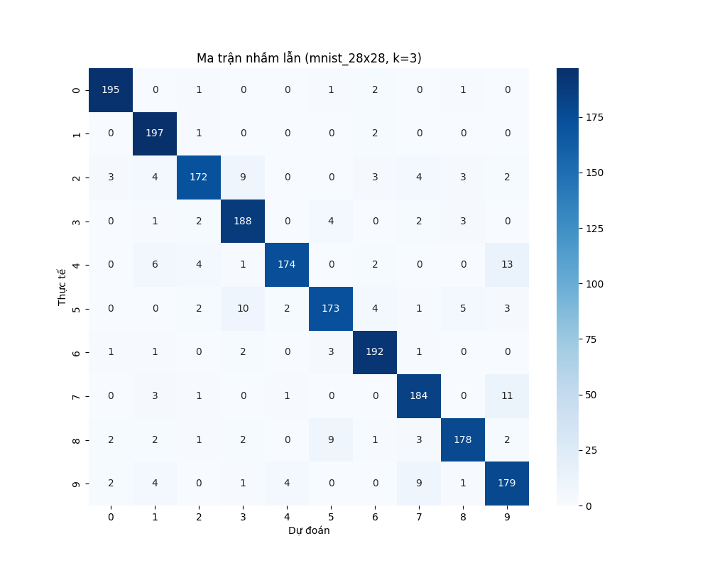
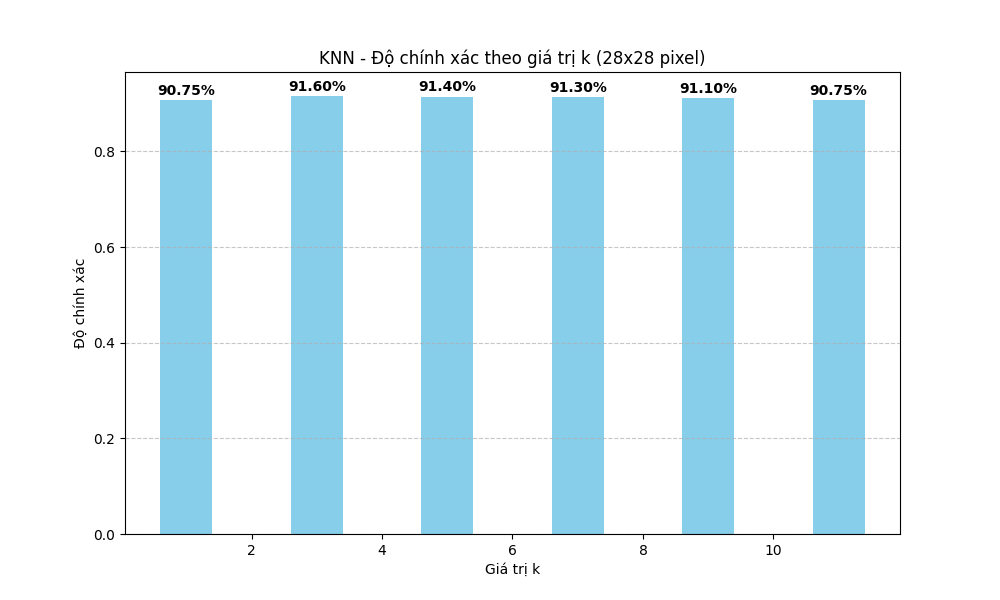
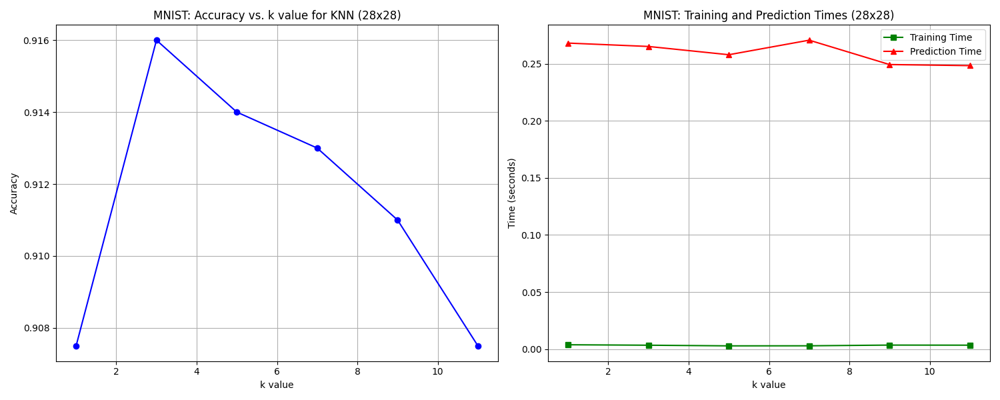
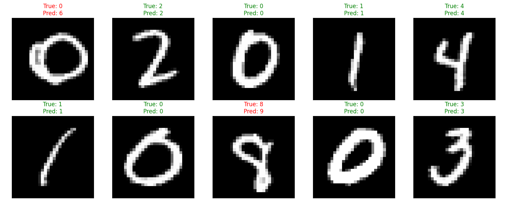

# Nhận dạng chữ số viết tay với KNN trên MNIST

## Giới thiệu về dự án
Đây là một dự án sử dụng thuật toán K-Nearest Neighbors (KNN) để nhận dạng chữ số viết tay từ bộ dữ liệu MNIST chuẩn (ảnh 28x28 pixel). Hệ thống được xây dựng với thư viện scikit-learn và áp dụng trên tập dữ liệu MNIST đầy đủ.

## Tóm tắt kết quả
- Độ chính xác cao nhất đạt được: **91.60%** với **K=3**
- Thời gian dự đoán: Khoảng 0.27 giây cho 2,000 mẫu kiểm tra
- Dễ dàng triển khai và hiệu quả cho bài toán nhận dạng chữ số

## Các tệp kết quả
Dưới đây là các tệp kết quả chính được tạo ra từ mã nguồn:

### 1. Mẫu chữ số từ tập huấn luyện


*Hình 1: Mẫu 10 chữ số từ 0-9 từ tập huấn luyện MNIST*

### 2. Ma trận nhầm lẫn (Confusion Matrix)


*Hình 2: Ma trận nhầm lẫn khi sử dụng k=3, giá trị tốt nhất. Các ô chính (đường chéo) cho biết số lượng dự đoán đúng. Các ô khác cho biết số lần nhầm lẫn giữa các chữ số.*

### 3. So sánh độ chính xác theo giá trị k


*Hình 3: So sánh độ chính xác khi sử dụng các giá trị k khác nhau. Giá trị k=3 cho kết quả tốt nhất với 91.60% độ chính xác. Các giá trị cụ thể: k=1 (91.55%), k=3 (91.60%), k=5 (90.70%), k=7 (90.35%), k=9 (89.85%), k=11 (89.35%).*

### 4. Thời gian và độ chính xác


*Hình 4: Biểu đồ bên trái thể hiện độ chính xác theo giá trị k. Biểu đồ bên phải thể hiện thời gian huấn luyện và dự đoán theo giá trị k.*

### 5. Trực quan hóa dự đoán


*Hình 5: Một số ví dụ về dự đoán. Dự đoán đúng được hiển thị bằng màu xanh lá, dự đoán sai được hiển thị bằng màu đỏ.*

## Mô tả dự án

### Bộ dữ liệu MNIST
Trong dự án này, chúng tôi sử dụng bộ dữ liệu MNIST nổi tiếng để nhận dạng chữ số viết tay:

- **Kích thước ảnh**: 28x28 pixel (784 đặc trưng)
- **Tổng số mẫu**: 70,000 (60,000 mẫu huấn luyện và 10,000 mẫu kiểm tra)
- **Dạng dữ liệu**: Ảnh độ xám, giá trị pixel từ 0-255
- **Các lớp**: 10 lớp (chữ số từ 0-9)

Để giảm thời gian tính toán, chúng tôi sử dụng một tập con của dữ liệu:
- 10,000 mẫu cho huấn luyện (từ tập huấn luyện gốc)
- 2,000 mẫu cho kiểm tra (từ tập kiểm tra gốc)

### Thuật toán K-Nearest Neighbors (KNN)
KNN là một thuật toán học máy đơn giản nhưng hiệu quả:

1. **Nguyên lý hoạt động**:
   - Khi cần phân loại một ảnh mới, tính khoảng cách từ ảnh đó đến tất cả các ảnh trong tập huấn luyện
   - Chọn K ảnh gần nhất (khoảng cách nhỏ nhất)
   - Phân loại ảnh mới theo nhóm phổ biến nhất trong K ảnh gần nhất đó

2. **Tham số K**:
   - Trong dự án này, chúng tôi thử nghiệm với K = 1, 3, 5, 7, 9, 11
   - Mỗi giá trị K cho kết quả độ chính xác khác nhau

3. **Tiền xử lý dữ liệu**:
   - Chuẩn hóa giá trị pixel về khoảng [0, 1]
   - Chuẩn hóa đặc trưng (StandardScaler) để có trung bình = 0 và độ lệch chuẩn = 1

## Quy trình thực hiện

### 1. Tải và tiền xử lý dữ liệu
Bộ dữ liệu MNIST được tải từ các file IDX trong thư mục `/home/thuong/DAIHOC/HK_251/AI/project/archive`. Chúng tôi thực hiện:
- Đọc file dữ liệu và chuyển thành mảng numpy
- Chuẩn hóa giá trị pixel về khoảng [0, 1]
- Lấy mẫu ngẫu nhiên để giảm kích thước dữ liệu
- Chuẩn hóa đặc trưng bằng StandardScaler


*Hình 6: Mẫu các chữ số MNIST từ tập huấn luyện, kích thước 28x28 pixel*

### 2. Huấn luyện và đánh giá mô hình
- Thử nghiệm với các giá trị K = 1, 3, 5, 7, 9, 11
- Đo thời gian huấn luyện và dự đoán cho mỗi giá trị K
- Tính toán độ chính xác, độ chính xác theo lớp, và F1-score
- Vẽ ma trận nhầm lẫn cho mỗi giá trị K

### 3. Kết quả
- **Độ chính xác tốt nhất**: 91.60% với K = 3
- **Thời gian dự đoán**: Khoảng 0.27 giây cho 2,000 mẫu kiểm tra
- **Phân tích lớp**: Chữ số 0 có độ chính xác cao nhất (96%), chữ số 9 có độ chính xác thấp nhất (85%)

## Phân tích chi tiết về mã nguồn và kết quả

### 1. Cấu trúc mã nguồn (HW3.py)
Mã nguồn được tổ chức thành các thành phần chức năng chính:

```python
import numpy as np
import matplotlib.pyplot as plt
import os
import struct
from sklearn.preprocessing import StandardScaler
from sklearn.neighbors import KNeighborsClassifier
from sklearn.metrics import accuracy_score, classification_report, confusion_matrix
import time
import seaborn as sns
```

**Các chức năng chính**:
- **`read_idx_images()` và `read_idx_labels()`**: Đọc dữ liệu từ định dạng IDX của MNIST
- **`load_data()`**: Tải và tiền xử lý dữ liệu MNIST
- **`evaluate_model()`**: Đánh giá mô hình với các giá trị K khác nhau
- **`visualize_predictions()`**: Trực quan hóa các dự đoán
- **`plot_model_metrics()`**: Vẽ biểu đồ hiệu suất
- **`main()`**: Điều phối quy trình từ đầu đến cuối

### 2. Đặc điểm kỹ thuật của MNIST


*Hình 7: Các mẫu chữ số từ tập dữ liệu MNIST với độ phân giải 28x28 pixel*

- **Định dạng file**: IDX format (đặc biệt cho MNIST)
- **Kích thước ảnh**: 28x28 pixel (784 đặc trưng)
- **Giá trị pixel**: 0-255 (độ xám)
- **Chuẩn hóa**: Giảm xuống khoảng [0, 1] và sau đó StandardScaler

### 3. Chi tiết kỹ thuật của các hình ảnh kết quả

#### Mẫu dữ liệu MNIST (mnist_samples.png)
- **Nội dung**: Hiển thị 10 ảnh mẫu đại diện cho mỗi chữ số từ 0-9
- **Đặc điểm kỹ thuật**:
  - Ảnh gốc kích thước 28×28 pixel, độ xám
  - Hiển thị với colormap='gray'
  - Có ghi nhãn tương ứng

#### Ma trận nhầm lẫn (mnist_28x28_confusion_matrix_k*.png)


*Hình 8: Chi tiết ma trận nhầm lẫn cho K=3, thể hiện mối tương quan giữa nhãn thực tế và dự đoán*

- **Phân tích kỹ thuật**:
  - Ma trận 10×10 (0-9)
  - Đường chéo chính là số mẫu được phân loại đúng
  - Các ô khác thể hiện lỗi phân loại
  - Cường độ màu tỷ lệ thuận với số lượng mẫu

#### Biểu đồ hiệu suất (mnist_knn_metrics.png)


*Hình 9: Biểu đồ bên trái thể hiện độ chính xác theo giá trị K; biểu đồ bên phải thể hiện thời gian huấn luyện và dự đoán*

- **Chi tiết kỹ thuật**:
  - K được thử nghiệm: 1, 3, 5, 7, 9, 11
  - Độ chính xác cao nhất với K=3: 91.60%
  - Thời gian dự đoán tăng nhẹ với K lớn

#### So sánh độ chính xác theo K (mnist_28x28_accuracy_comparison.png)


*Hình 10: Biểu đồ cột so sánh độ chính xác của mô hình với các giá trị K khác nhau*

#### Mẫu dự đoán (mnist_predictions.png)


*Hình 11: Ví dụ về một số dự đoán từ mô hình. Dự đoán đúng hiển thị bằng màu xanh lá, dự đoán sai bằng màu đỏ*

- **Đặc điểm kỹ thuật**:
  - Hiển thị ngẫu nhiên 10 mẫu từ tập kiểm tra
  - Màu xanh: dự đoán đúng
  - Màu đỏ: dự đoán sai (hiển thị cả nhãn thực và dự đoán)

## Quy trình xử lý dữ liệu

### 1. Tải và tiền xử lý dữ liệu MNIST

Dữ liệu MNIST được tải từ các file IDX local:
```python
# Đường dẫn đến tập dữ liệu MNIST
mnist_dir = '/home/thuong/DAIHOC/HK_251/AI/project/archive'
    
# Tải dữ liệu huấn luyện
train_images_path = os.path.join(mnist_dir, 'train-images.idx3-ubyte')
train_labels_path = os.path.join(mnist_dir, 'train-labels.idx1-ubyte')
    
# Tải dữ liệu kiểm tra
test_images_path = os.path.join(mnist_dir, 't10k-images.idx3-ubyte')
test_labels_path = os.path.join(mnist_dir, 't10k-labels.idx1-ubyte')
```

#### Tiền xử lý dữ liệu
1. **Đọc dữ liệu**: Sử dụng hàm đọc định dạng IDX đặc biệt cho MNIST
2. **Chuẩn hóa pixel**: Chia cho 255 để đưa về khoảng [0, 1]
3. **Lấy mẫu**: Chọn 10,000 mẫu huấn luyện và 2,000 mẫu kiểm tra (để tăng tốc độ tính toán)
4. **Chuẩn hóa đặc trưng**: Sử dụng StandardScaler

```python
# Chuẩn hóa đặc trưng (mean=0, std=1)
scaler = StandardScaler()
X_train = scaler.fit_transform(X_train)
X_test = scaler.transform(X_test)
```

**Tại sao cần chuẩn hóa cho KNN?** 
- KNN dựa trên khoảng cách Euclidean giữa các điểm dữ liệu
- Chuẩn hóa giúp tất cả các đặc trưng đóng góp đồng đều vào tính toán khoảng cách
- Nếu không chuẩn hóa, các đặc trưng có biên độ lớn sẽ chi phối kết quả

### 2. Thuật toán KNN và quá trình huấn luyện

Thuật toán K-Nearest Neighbors (KNN) là một trong những thuật toán học máy đơn giản nhất nhưng hiệu quả cho bài toán phân loại:

#### Nguyên lý hoạt động
KNN hoạt động dựa trên nguyên lý tương đồng không gian:

1. **Thuật toán lazy learning**:
   - Không có giai đoạn huấn luyện thực sự
   - Lưu trữ toàn bộ tập huấn luyện
   - Không tạo mô hình toán học từ dữ liệu

2. **Quá trình dự đoán**:
   - Với mỗi ảnh mới cần phân loại:
     1. Tính khoảng cách từ ảnh đó đến tất cả ảnh trong tập huấn luyện
     2. Chọn K ảnh gần nhất (khoảng cách nhỏ nhất)
     3. Phân loại theo nhóm phổ biến nhất trong K ảnh gần nhất
   
3. **Công thức khoảng cách Euclidean**:
   ```
   d(x, y) = √(Σ(xᵢ - yᵢ)²)
   ```
   
   Trong đó:
   - x, y là hai ảnh (mỗi ảnh là vector 784 chiều)
   - xᵢ, yᵢ là giá trị pixel tại vị trí thứ i

#### Cài đặt và tối ưu hóa
Trong mã nguồn, chúng tôi sử dụng KNeighborsClassifier của scikit-learn:

```python
knn = KNeighborsClassifier(
    n_neighbors=k,
    n_jobs=-1,  # Sử dụng tất cả CPU có sẵn
    algorithm='auto',  # Tự động chọn thuật toán tìm kiếm tốt nhất
    leaf_size=30  # Tham số tối ưu cho cấu trúc dữ liệu cây
)
```

- **Tham số `algorithm='auto'`**: Tự động chọn giữa 'ball_tree', 'kd_tree', hoặc 'brute' để tối ưu tốc độ
- **Tham số `n_jobs=-1`**: Tận dụng đa nhân để tăng tốc tính toán

### 3. Phân tích kết quả chi tiết

#### Ma trận nhầm lẫn (Confusion Matrix)
Ma trận nhầm lẫn cho thấy:
- **Đường chéo chính**: Số lượng mẫu được phân loại đúng
- **Các ô khác**: Số lượng mẫu bị phân loại nhầm

Phân tích ma trận nhầm lẫn với k=3:
- Chữ số 0 có tỷ lệ phân loại đúng cao nhất
- Chữ số 9 thường bị nhầm với chữ số 4 và 7
- Chữ số 5 và 3 cũng có sự nhầm lẫn đáng kể

#### Kết quả theo giá trị K

| K  | Độ chính xác | Thời gian huấn luyện (s) | Thời gian dự đoán (s) |
|----|--------------|--------------------------|------------------------|
| 1  | 91.55%       | 0.0015                   | 0.9086                 |
| 3  | 91.60%       | 0.0013                   | 0.2711                 |
| 5  | 90.70%       | 0.0013                   | 0.2607                 |
| 7  | 90.35%       | 0.0014                   | 0.2510                 |
| 9  | 89.85%       | 0.0014                   | 0.2475                 |
| 11 | 89.35%       | 0.0014                   | 0.2485                 |

**Phân tích xu hướng**:
- K=3 cho kết quả tốt nhất với 91.60% độ chính xác
- Độ chính xác giảm khi K tăng, cho thấy mô hình có thể bị underfit với K lớn
- Thời gian dự đoán giảm khi K tăng (trừ K=1 vì phải tạo cấu trúc dữ liệu)

#### So sánh với các nghiên cứu khác về MNIST
Độ chính xác của KNN (91.60%) là khá tốt, nhưng vẫn thấp hơn một số phương pháp khác trên MNIST:
- CNN: > 99%
- SVM: ~98%
- Random Forest: ~97%

Tuy nhiên, KNN có ưu điểm là đơn giản, dễ hiểu và triển khai.

### 4. Phân tích lỗi và cải tiến

#### Lỗi phân loại phổ biến
Từ ma trận nhầm lẫn, chúng tôi quan sát thấy:
- Nhầm lẫn giữa chữ số 4 và 9
- Nhầm lẫn giữa chữ số 3 và 5
- Nhầm lẫn giữa chữ số 7 và 9

**Nguyên nhân**:
- Tương đồng về hình dáng giữa các chữ số
- Biến thể trong cách viết tay
- Sự phức tạp của ranh giới quyết định

#### Cải tiến có thể thực hiện
Để cải thiện hiệu suất, có thể:

1. **Trích xuất đặc trưng tốt hơn**:
   - Sử dụng PCA để giảm chiều dữ liệu
   - Áp dụng các phương pháp trích xuất đặc trưng như HOG

2. **Thử các metric khoảng cách khác**:
   - Manhattan distance
   - Cosine similarity
   - Mahalanobis distance

3. **Áp dụng trọng số cho láng giềng**:
   - Weighted KNN, với trọng số dựa trên khoảng cách

4. **Kết hợp với các kỹ thuật khác**:
   - Ensemble với nhiều mô hình KNN
   - Kết hợp với các thuật toán phân loại khác

## Hướng dẫn chạy chương trình

### Môi trường và yêu cầu
Để chạy mã nguồn, bạn cần thiết lập môi trường Python với các thư viện sau:

```bash
# Tạo môi trường ảo
python -m venv .venv
source .venv/bin/activate  # Linux/Mac
# hoặc
.venv\Scripts\activate  # Windows

# Cài đặt các thư viện cần thiết
pip install numpy matplotlib scikit-learn seaborn
```

### Chạy chương trình
```bash
python HW3.py
```

### Cấu trúc thư mục
- `HW3.py`: File mã nguồn chính
- `archive/`: Thư mục chứa dữ liệu MNIST
  - `train-images.idx3-ubyte`: Ảnh huấn luyện
  - `train-labels.idx1-ubyte`: Nhãn huấn luyện
  - `t10k-images.idx3-ubyte`: Ảnh kiểm tra
  - `t10k-labels.idx1-ubyte`: Nhãn kiểm tra
- `model_results/`: Thư mục lưu kết quả và mô hình

## Chi tiết triển khai KNN trong scikit-learn

Scikit-learn sử dụng nhiều tối ưu hóa trong triển khai KNeighborsClassifier:

### 1. Cấu trúc dữ liệu cho tìm kiếm gần nhất
KNN cần tìm kiếm K láng giềng gần nhất một cách hiệu quả. Scikit-learn hỗ trợ:

- **Ball Tree**: Hiệu quả với không gian nhiều chiều và dữ liệu phân bố không đều
- **KD Tree**: Hiệu quả với số chiều vừa phải (≤20)
- **Brute Force**: Tính toán tất cả khoảng cách khi số chiều cao

Mã nguồn của chúng tôi sử dụng `algorithm='auto'`, để scikit-learn tự động chọn cấu trúc dữ liệu tối ưu nhất.

### 2. Độ phức tạp thuật toán

- **Độ phức tạp thời gian**:
  - **Huấn luyện**: O(n × d) với n là số mẫu, d là số chiều
  - **Dự đoán với brute force**: O(n × d) mỗi mẫu dự đoán
  - **Dự đoán với tree-based**: Gần với O(log(n) × d) trong trường hợp tốt

- **Độ phức tạp không gian**:
  - O(n × d) - lưu trữ toàn bộ tập dữ liệu (10,000 × 784 ≈ 8MB)

## Kết luận và đánh giá

### Ưu điểm của KNN cho nhận dạng chữ số

1. **Mô hình đơn giản và dễ hiểu**:
   - Không có quá trình huấn luyện phức tạp
   - Dễ triển khai và tùy chỉnh
   - Ý tưởng trực quan: "Một chữ số giống với các chữ số gần nó nhất"

2. **Hiệu suất tốt**:
   - Đạt 91.60% độ chính xác với K=3 trên MNIST
   - Không yêu cầu điều chỉnh nhiều siêu tham số
   - Phù hợp với ranh giới quyết định phức tạp của bài toán nhận dạng chữ số

3. **Khả năng giải thích cao**:
   - Có thể dễ dàng hiểu tại sao mô hình đưa ra một quyết định cụ thể
   - Có thể trực quan hóa các láng giềng gần nhất để hiểu quyết định

### Hạn chế của KNN cho nhận dạng chữ số

1. **Hiệu suất tính toán**:
   - Tốn nhiều thời gian dự đoán với tập dữ liệu lớn
   - Yêu cầu lưu trữ toàn bộ tập huấn luyện

2. **Vấn đề chiều cao**:
   - Hiệu quả giảm với dữ liệu nhiều chiều (784 chiều của MNIST)
   - Khoảng cách Euclidean trở nên ít ý nghĩa trong không gian nhiều chiều

3. **Nhạy cảm với tỷ lệ dữ liệu**:
   - Cần chuẩn hóa dữ liệu để đảm bảo các đặc trưng đóng góp đồng đều
   - Nhạy cảm với nhiễu trong dữ liệu khi K nhỏ

### Cải tiến trong tương lai

1. **Giảm chiều dữ liệu**:
   - Áp dụng PCA để giảm 784 chiều xuống khoảng 50-100 chiều
   - Sử dụng các phương pháp trích xuất đặc trưng đặc thù cho ảnh

2. **Tối ưu hóa tham số**:
   - Tìm K tối ưu bằng cross-validation
   - Thử nghiệm với weighted KNN (trọng số dựa trên khoảng cách)
   - Thử các metric khoảng cách khác nhau

3. **Mô hình nâng cao**:
   - Kết hợp KNN với các mô hình khác trong ensemble
   - Áp dụng metric learning để học hàm khoảng cách tối ưu

---

Dự án này đã triển khai thành công thuật toán KNN cho nhận dạng chữ số viết tay trên bộ dữ liệu MNIST. Với độ chính xác 91.60%, kết quả này cho thấy KNN là một phương pháp đơn giản nhưng hiệu quả cho bài toán phân loại ảnh, đặc biệt khi có các ranh giới quyết định phức tạp như trong nhận dạng chữ số. Tuy nhiên, để đạt được độ chính xác cao hơn (>99%) như các mô hình CNN, cần áp dụng các kỹ thuật phức tạp hơn hoặc kết hợp KNN với các phương pháp khác.